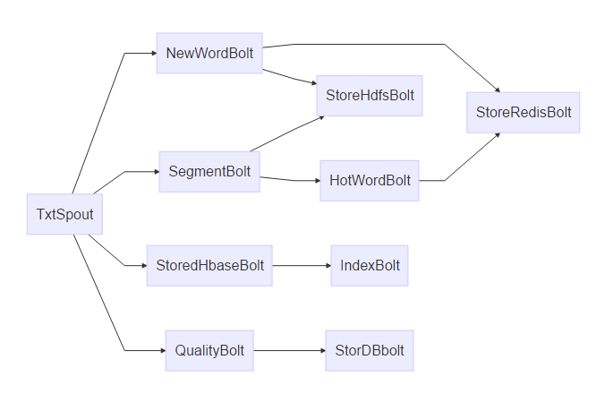

## TSP-(Txt-Stream-Process)
### 说明
> 将kafka中的消息接入到jstorm进行流式处理：

### 项目结构
#### tsp-kafka
> 提供了`kafka-v0.10.2`的支持

#### tsp-producer
> 模拟线上生成消息数据

#### tsp-topology
> 流式处理拓扑图
> `TxtSpout` 数据源，从kafka中拽去数据，接入到jstorm中

### 运行
> 依赖： `maven`, `jdk8`, `kafka-0.10.2`, `jstorm-2.2.1`, `hadoop-cdh-5.5.4`,`redis-3.x`
1. 编译
`mvn package -DskipTests`

2. 运行消费者
`java -jar tsp-producer.jar com.alleyz.tsp.producer.Application`

3. 本地运行topology
右击运行`com.alley.tsp.topo.TxtTopology`

### 其他
**目前处于调试阶段**

